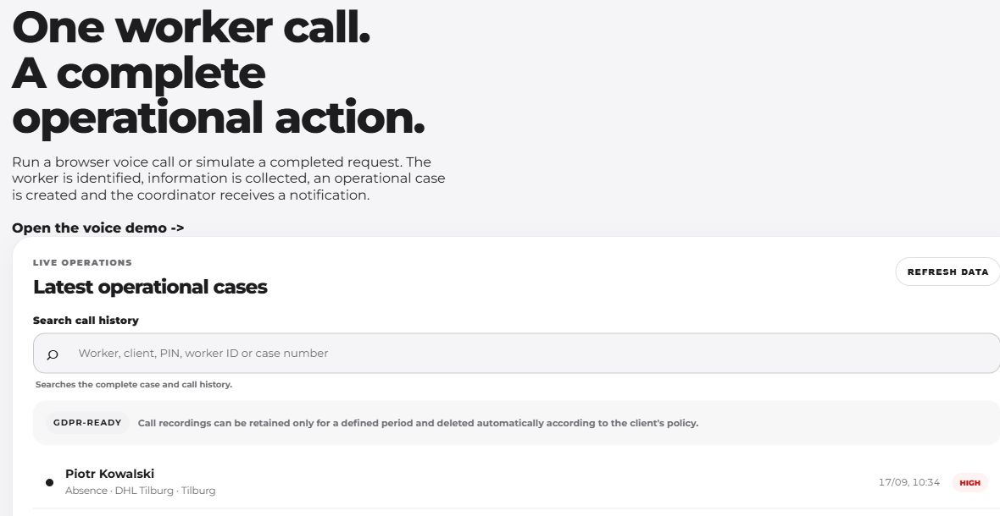
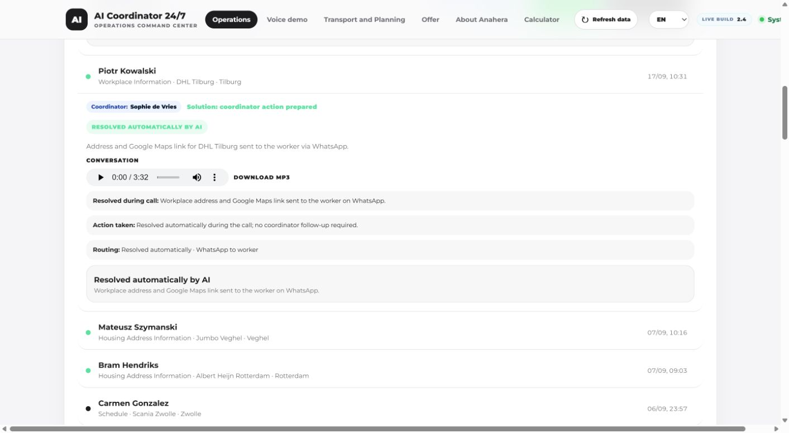
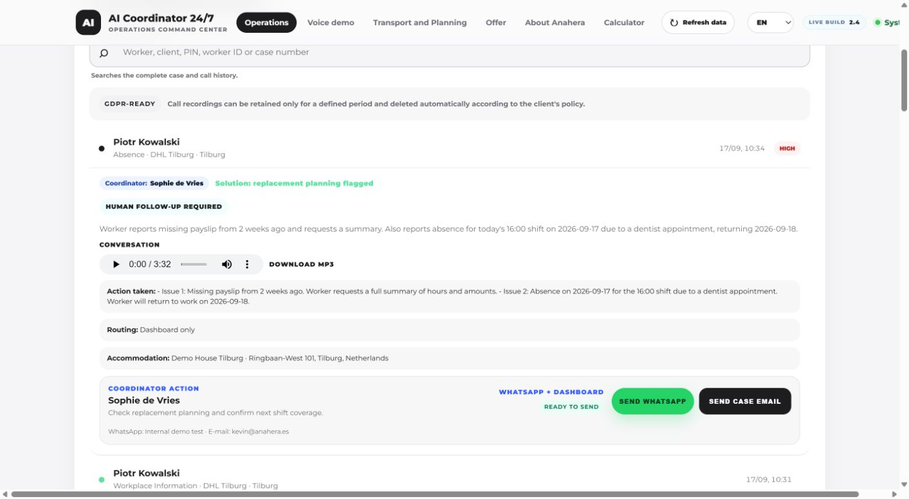

# AI Coordinator: from a phone call to an operational action

**Kevin Marchwiak · Founder and product builder, Anahera**

Screenshots captured from the running authenticated demo on 19 September 2026. Worker identities and operational scenarios are fictional demo data. Dashboard volumes, branch counts, scores, response times and savings estimates are illustrative, not measured customer performance. Company names shown are demonstration context, not endorsements or customer claims.

I built AI Coordinator for the questions staffing teams receive outside office hours: a worker needs a workplace address, reports an absence, has a transport problem or needs help with housing. My contribution covers the workflow and application architecture, ElevenLabs agent configuration, telephony integration, backend tools, dashboard and validation. I use Codex extensively for implementation and debugging and own the product decisions and acceptance checks.

## How it works

**Twilio phone call → ElevenLabs conversation → Node.js backend tools → recorded outcome → dashboard and, where needed, human follow-up.**

The Coordinator has two documented telephone lines and two assigned agents for NL and demo use. The backend associates the caller with worker context, verifies the worker's PIN for protected information and validates the details needed for the requested action. The language model handles the conversation; backend functions control data retrieval, messaging and case creation.

## 1. One view across branch offices

**Caption:** The management and office views bring cases, categories, urgency and follow-up into one interface. The branch demonstration uses illustrative data to show how managers can move between the overall workload and an individual branch. Displayed branch counts do not represent customer deployments.

## 2. A routine request handled during the call

**Caption:** For a workplace or housing address request, the backend retrieves the verified address and, after explicit consent, sends a Google Maps link through Twilio WhatsApp. The case records the action and messaging status. Conversation-level idempotency prevents duplicate sends from repeated tool calls. Accepted, delivered and read statuses are distinct; a failed send remains visible for attention.

## 3. A complete case for a person to handle

**Caption:** Absence, transport and other issues requiring a decision become structured cases with worker, branch, category, urgency and a concise summary. Configured routing notifies the coordinator and, where appropriate, management or back office. AI collects and routes the information; the responsible person decides the operational response.

## Reliability and verification

- A supporting transport-planning test removed a vehicle, exposed five unassigned workers and blocked approval of the incomplete plan. The transport, roster and routing suite passed 35 tests.
- A controlled fictional ride test verified WhatsApp delivery to worker, driver and coordinator recipients. Delivery is not personal acknowledgement.
- Public demonstrations use fictional worker and office data. Customer deployment requires its own data, access controls, consent and recipient configuration. Test results are not measured customer ROI.

## Related work: AI Receptionist

AI Receptionist uses ElevenLabs tool calls for availability, booking, rescheduling and cancellation. Session tokens isolate public-demo workspaces, and backend validation determines whether an action succeeds. A separate sales-booking flow preserves confirmed booking context across WhatsApp replies. Fixing a repeated sales prompt after booking passed 16 focused regression tests and 251 wider automation tests.

## Development approach

I work from the business scenario through implementation and deployment, testing the conversation and the resulting action together. A private RAG service built with OpenAI embeddings and PostgreSQL/pgvector retrieves approved technical documentation to support work across projects.

Portfolio: https://anahera.es · GitHub: https://github.com/xkevinemx

---

This case study contains screenshots and an architectural overview only. Application source code and private operational data are not included.
